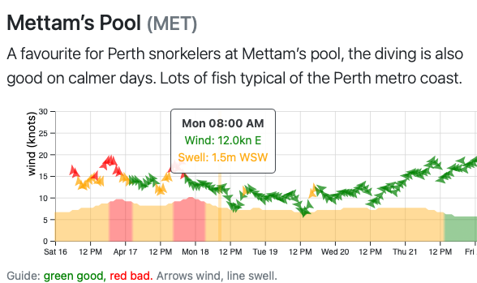

## Showing site weather on Vis.Report

[Vis.Report](https://vis.report) is a website that allows divers to share visibility reports - a measure of underwater site conditions.

In a [previous blog post](https://padmorrison.com/posts/2021-09-05-predicting-underwater-visibility/), I have described how I plan to use this data to predict site visibility. Over the last two years, divers have contributed over 400 reports. We are making good progress on the amount of data needed to resolve the fine details!

In the meantime (and to encourage more reports) I have added a weather forecast function. One site I use often is [Seabreeze](https://www.seabreeze.com.au/weather/wind-forecast/perth), which shows a simple wind and swell forecast with colour coding for wind speed. I have always wanted a version fine-tuned by dive site, and that can also take into account wind direction - which is often more important than wind speed (more on that in a moment).

This post describes the mechanics of that system, which is used by Vis.Report to produce interactive graphs for the week ahead. If wind (arrows) and swell (area) are both green - you should have a pleasant dive.

[](http://vis.report/MET)

## Every site responds to weather differently

A popular snorkel site in Perth is the Mettam's Pool in Marmion (<https://vis.report/MET>). It is a relatively well-protected shallow reef, with a huge variety of marine life.

```{r map}
library(leaflet)  
leaflet(options = leafletOptions(minZoom = 10, maxZoom = 13)) %>%
  setView(lng=115.747833, lat=-31.963271, zoom = 10) %>% 
  addProviderTiles(providers$CartoDB.Voyager) %>% 
  addCircleMarkers(opacity=0, fillOpacity=0,
                   lng=115.747833, lat=-31.863271,
                   label="Mettam's Pool",
                   labelOptions = labelOptions(noHide = T, textsize = "15px"))
```

Access to the site, and underwater conditions are very weather dependent.

Ideally you are looking for swell less than 1m, so that you can get into the water without being knocked over by a wave. You are also hoping for light easterly winds, which come off the land. On the other hand, a strong westerly (say above 10 knots) will create wind waves on the ocean's surface, making it choppy and reducing underwater visibility. This can be represented using a wind rose, where green shows ideal conditions, and red shows poor conditions.

```{=html}
<script src="https://d3js.org/d3.v7.min.js"></script>
```
::: {#windrose}
:::

### Representing site response to weather

This wind information can be represented formally as a table, using a column for wind angle (degrees), wind speed (knots), and a score (0 = ideal, 1 = marginal, 2 = poor).

```{r condition_table}
library(tidyverse)
read_csv('wind_csv.csv') %>%
  select(-label) %>% 
  rmarkdown::paged_table(options = list(rows.print=8))
```

The Javascript code block below shows how this table can be turned into the wind rose above using the d3 visualisation library.[^1]

[^1]: On Vis.Report, this is saved into the database for each site. Notice how you can click the wind rose to change its colour. You are able to post this modified table back to to the database using a button with the id="wind_button", and a custom onsubmit event for the form: <small> document.getElementById('wind_button').value = d3.csvFormat(d3.selectAll('path').data());</small>

```{js windrose}
var width = 330
height = 330
margin = 5

var radius = Math.min(width, height) / 2 - margin

//select windrose div and add graph spaces
var svg = d3.select("#windrose")
    .append("svg")
    .attr("width", width)
    .attr("height", height)
    .append("g")
    .attr("transform", "translate(" + width / 2 + "," + height / 2 + ")");


//read in the conditions table
var wind_data = d3.csv("wind_csv.csv", d3.autoType).then((data) => {

    //define colours
    var color = d3.scaleOrdinal()
        .domain([0, 1, 2])
        .range(["#5cb85c", "#f0ad4e", "#d9534f"]);

    //build the arcs for wind direction
    var arc = d3.arc()
        .innerRadius(function (d) { return d.wind * radius / 20 })
        .outerRadius(function (d) { return (d.wind + 5) * radius / 20 })
        .startAngle(function (d) { return (d.angle - 22.5) * (Math.PI / 180) })
        .endAngle(function (d) { return (d.angle + 22.5) * (Math.PI / 180) })


    //define update score function for click event
    var updatescore = function (d, i) {
        i.score = (i.score == 2 ? 0 : i.score + 1)

        d3.select(this)
            .style("fill", function (d) { return color(i.score); });

    };

    //colour each arc by score
    svg.append('g')
        .selectAll("path")
        .data(data)
        .enter()
        .append("path")
        .attr("d", function (d) { return arc(d); })
        .style("fill", function (d) { return color(d.score) })
        .style("stroke", '#EAECEE')
        .on("click", updatescore)

    //add in the labels
    svg
        .selectAll('labels')
        .data(data)
        .enter()
        .append('text')
        .attr("font-size", 14)
        .attr("pointer-events", "none")
        .text(function (d) { return d.label })
        .attr('fill', 'white')
        .attr('transform', function (d) {
            var pos = arc.centroid(d)
            return 'translate(' + pos + ')';
        })


}).catch((error) => {
    console.error("Error loading the data");
});
```

## Getting the weather forecast with the WillyWeather API

Vis.Report is built in Django, which is a Python web framework. Most of this post is written in Python, which means it can be run directly in a Django views (this is how it is implemented in Vis.Report). For the full code, visit the [GitHub repository for this post](https://github.com/patrick-morrison/dive_weather_python_d3_post) or [the repository for Vis.Report](https://github.com/patrick-morrison/visreport2).[^2]

[^2]: The back-end python code is mostly in [this views file](https://github.com/patrick-morrison/visreport2/blob/main/weather/views.py). This front-end graphing is in [the templates](https://github.com/patrick-morrison/visreport2/tree/main/weather/templates/weather).

```{r python_config}
# needs virtual environment
# python3 -m venv .venv
# source .venv/bin/activate
# pip install -r requirements.txt
Sys.setenv(RETICULATE_PYTHON = paste0(getwd(), "/.venv/bin/python"))
library(reticulate)
WILLYWEATHER_API = Sys.getenv("WILLYWEATHER_API")
```

In Australia, the best API for coastal weather is [WillyWeather](https://www.willyweather.com.au/info/api.html). For just over a 100 requests per day it works out to cost about a dollar a year. Once you have an API key, querying it with the Python requests library is easy:

1.  Get the nearest location in their database ([docs](https://www.willyweather.com.au/api/docs/v2.html#search))

2.  Get the forecast ([docs](https://www.willyweather.com.au/api/docs/v2.html#forecast-get-swell))

3.  Check this has swell as well as wind, and if it doesn't choose the closest that does [docs](https://www.willyweather.com.au/api/docs/v2.html#location-get-get-closest-locations)

4.  Pull the swell and wind data out of the json responses using `pd.json_normalize`

5.  Combine them into a table with `pd.merge` (remembering the fill the NAs produced by the 5-7 day swell forecast being 2-hourly)

```{python weather_forecast}
import pandas as pd
import numpy as np
import arrow
import requests

api_key = r.WILLYWEATHER_API
# or os.getenv('WILLYWEATHER_API')

# coordinates for Mettam's Pool
lat = -31.963271
lon = 115.747833

# Willyweather search api endpoint
search_url = f'https://api.willyweather.com.au/v2/{api_key}/search.json'

# Find closest point
search = requests.get(
  search_url,
  params={
    'lat': lat,
    'lng': lon,
    "range": 20,
    "distance": "km"
  },
)

# Get the station id for next step
id = search.json()['location']['id']


# Willyweather forecast api endpoint
forecast_url = f'https://api.willyweather.com.au/v2/{api_key}/locations/{id}/weather.json'

# Get forecast
forecast = requests.get(
  forecast_url,
  params={
    'forecasts': 'wind,swell',
    'days': 7,
  },
)

# Read the forecast response
weather_json = forecast.json()

# Check for swell data (not all sites has it)
# if no swell data, find the closest location that has it
if not weather_json['forecasts']['swell']:
    close_url = f'https://api.willyweather.com.au/v2/{api_key}/search/closest.json'
    close = requests.get(
    close_url,
    params={
        'id':id,
        'weatherTypes':"swell",
        "distance": "km"
    },
    )

    id = close.json()['swell'][0]['id']

    forecast_url = f'https://api.willyweather.com.au/v2/{api_key}/locations/{id}/weather.json'
    startDate = arrow.now().floor('day').format('YYYY-MM-DD')

    forecast = requests.get(
    forecast_url,
    params={
        'forecasts': 'wind,swell',
        'days': 7,
        'startDate': startDate,  # Convert to UTC timestamp
    },
    )
    weather_json = forecast.json()
    
# Convert wind json to pandas dataframe
wind_data = pd.json_normalize(weather_json['forecasts']['wind']['days'],
record_path='entries'
).rename(
  columns={"speed": "wind", "direction": "wind_dir",
  "directionText": "wind_dir_text"})

# Convert swell json to pandas dataframe
swell_data = pd.json_normalize(
  weather_json['forecasts']['swell']['days'],
  record_path='entries'
).drop(['period', 'direction'], axis=1
).rename(columns={"height": "swell", "directionText": "swell_dir_text"})

# Merge together and fill
weather = pd.merge(
    wind_data,
     swell_data, how="left", on=['dateTime']
     ).fillna(method="ffill")

# Show table
weather.head()
```

## Scoring the forecast

Scoring the forecast involves a join to the wind table, and a function for swell. On the forecast table, wind speed is rounded down to the nearest 5 knots, and wind angle is rounded to the nearest 45 degrees. This table is then left-joined to the wind condition table. A function for swell defining marginal (1.2m for Mettam's) and maximum (1.8m) is applied to the swell height. These are both combined with the original forecast and saved as a csv, for passing to the graphing function.^[On Vis.Report, this is a csv endpoint for each site. Each time it is called, it calculates the scores against the weather forecast. If the weather forecast has been refreshed in the last 3 hours it just pulls it from the database. Otherwise, it updates before scoring. See for [Mettam's Pool](https://vis.report/sites_weather/met/weather_csv/).]

```{python scoring}
# Read the conditions table to pandas
con = pd.read_csv('wind_csv.csv').drop('label', axis=1)

# function to limit rounded wind speed to 15 knots
def clamp(n, maxn=15):
    return max(min(maxn, n), 0)
    
# round wind speed to nearest 5kn
# round wind angle to nearest 45 degrees
# this is so it can be joined to the score table
rounded = pd.DataFrame({
    'wind': pd.to_numeric(
        5*((weather['wind']*0.54/5
    ).apply(np.floor)), downcast='integer'
    ).apply(clamp),
    'angle': pd.to_numeric(
      45*((weather['wind_dir']/45).apply(np.round)),
      downcast='integer').replace([360],0),
})

# join rounded wind values to score table
wind = pd.merge(
    rounded,
     con, how="left", on=["angle", "wind"]
).rename({'score': 'wind_score'}, axis=1)

# function to score swell
# if it is over marginal, it gets a score of 1
# if it is over bad, it gets a score of 2
def swell_calc(swell, marginal, bad):
    if swell <= marginal:
        score = 0
    elif swell <= bad:
        score = 1
    else:
        score = 2
    return score

# score swell
swell = weather['swell'].apply(
  swell_calc, marginal=1.2, bad = 1.8)

# function to cap total score (wind + swell) to 2
def cap(n):
    return min(n, 2)

# construct table of conditions and scores
scores = pd.DataFrame({
    'time': weather['dateTime'],
    'swell': weather['swell'],
    'swell_dir_text' : weather['swell_dir_text'],
    'wind': (weather['wind']*0.54).round(decimals = 1),
    'wind_dir': weather['wind_dir'],
    'wind_dir_text' : weather['wind_dir_text'],
    'swell_score': swell,
    'wind_score': wind['wind_score'],
    'total_score': (swell+wind['wind_score']).apply(cap),
    })

# csv to be passed to d3
scores.to_csv('scores.csv')

scores.head()
```

## Showing the forecast

This table of conditions and their scores can be passed back to d3 for plotting. This plot shows wind as arrows, with y = speed in knots and pointing in the direction of wind flow. It shows swell as an area with y = height in metres. Both of these are coloured by their scores. This summarises the week, with ideal diving conditions shown in green, marginal days in yellow, and poor days in red.

::: {#weather style="overflow-x: scroll; width: 100%;"}
:::

The CSS:

```{css forecast_plot_style}
.grid line {
  stroke: lightgrey;
  stroke-opacity: 0.7;
  shape-rendering: crispEdges;
}

.grid path {
  stroke-width: 0;
}

.line {
  stroke: url(#swell_gradient);
  stroke-width: 1.5;
  fill : url(#swell_gradient);
  opacity : 0.4;
}
```

And the Javascript:

```{js forecast_plot}
// set the dimensions and margins of the graph
var margin_weather = { top: 10, right: 40, bottom: 30, left: 60 },
    width_weather = 700 - margin_weather.left - margin_weather.right,
    height_weather = 200 - margin_weather.top - margin_weather.bottom;

// append the svg object to the body of the page
var svg_weather = d3.select("#weather")
    .append("svg")
    .attr("width", width_weather + margin_weather.left + margin_weather.right)
    .attr("height", height_weather + margin_weather.top + margin_weather.bottom)
    .append("g")
    .attr("transform",
        "translate(" + margin_weather.left + "," + margin_weather.top + ")");


//read in csv
var wind_data = d3.csv("scores.csv").then((data) => {

    //parse the time
    var parseTime = d3.timeParse("%Y-%m-%d %H:%M:%S");
    var dates = [];
    for (let obj of data) {
        dates.push(parseTime(obj.time));
    }


    //setup x axis
    var domain = d3.extent(dates);

    function make_x_gridlines() {
        return d3.axisBottom(x)
            .ticks(10)
    }

    var x = d3.scaleTime()
        .domain(domain)
        .range([0, width_weather]);

    svg_weather.append("g")
        .attr("transform", "translate(0," + height_weather + ")")
        .call(d3.axisBottom(x));

    svg_weather.append("g")
        .attr("class", "grid")
        .attr("transform", "translate(0," + height_weather + ")")
        .call(make_x_gridlines()
            .tickSize(-height_weather)
            .tickFormat("")
        )

    svg_weather.append("text")
        .attr("class", "y label")
        .attr("text-anchor", "end")
        .style("font-size", "14px")
        .attr("y", 6)
        .attr("dy", "-2.2em")
        .attr("transform", "rotate(-90)")
        .text("wind (knots)");


    //setup dual y axis
    function make_y_gridlines() {
        return d3.axisLeft(y)
            .ticks(5)
    }

    var y = d3.scaleLinear()
        .domain([0, 30])
        .range([height_weather, 0]);

    svg_weather.append("g")
        .call(d3.axisLeft(y)
            .ticks(5));

    var y1 = d3.scaleLinear()
        .domain([0, 6])
        .range([height_weather, 0]);

    svg_weather.append("g")
        .attr("class", "grid")
        .call(make_y_gridlines()
            .tickSize(-width_weather)
            .tickFormat("")
        )

    svg_weather.append("g")
        .attr("transform", "translate(600,0)")
        .call(d3.axisRight(y1).ticks(5));


    svg_weather.append("text")
        .attr("class", "y label")
        .attr("text-anchor", "end")
        .style("font-size", "14px")
        .attr("y", 6)
        .attr("dy", "590")
        .attr("transform", "rotate(-90)")
        .text("swell (m)");


    //define score colors
    var wind_colours = d3.scaleOrdinal()
        .domain([0, 1, 2])
        .range(['green', 'orange', 'red']);

    //setup swell color gradient (see also css)
    svg_weather.append("linearGradient")
        .attr("id", "swell_gradient")
        .attr("gradientUnits", "userSpaceOnUse")
        .attr("x1", 0)
        .attr("x2", width_weather)
        .selectAll("stop")
        .data(data)
        .join("stop")
        .attr("offset", d => x(parseTime(d.time)) / width_weather)
        .attr("stop-color", d => wind_colours(parseInt(d.swell_score)));

    svg_weather.append("path")
        .datum(data)
        .attr("class", "line")
        .attr("stroke-width", 1.5)
        .attr("d", d3.area()
            .x(function (d) { return x(parseTime(d.time)) })
            .y0(y(0))
            .y1(function (d) { return y(d.swell * 5) })
        )


    //add in arrows    
    d3.select("#weather")
        .select('g')
        .selectAll('path')
        .data(data)
        .enter()
        .append('path')
        .attr('transform', function (d) {
            return 'translate(' + x(parseTime(d.time)) + ',' + y(d.wind) + ' ) rotate(' + d.wind_dir + ')';
        })
        .attr('d', "M2.2 0 0 6.6 0 6.6 0 6.6-2.2 0-5.5-6.6 0-4.4 5.5-6.6Z")
        .style("fill", function (d) { return wind_colours(parseInt(d.wind_score)); })
        .style("opacity", 0.7)


    //add tooltip div    
    var Tooltip = d3.select("#weather")
        .append("div")
        .style("opacity", 0)
        .style("position", 'absolute')
        .attr("class", "tooltip text-center")
        .style("background-color", "white")
        .style("border", "solid")
        .style("height", "0px")
        .style("border-width", "1px")
        .style("border-color", "#343a40")
        .style("border-radius", "5px")
        .style("padding", "6px")
        .style("top", "0px")
        .style("left", "0px")

    const formatTime = d3.timeFormat("%a %I:00 %p");

    //define mouseover functions to create tooltip  
    var mouseover = function (event, a) {
        Tooltip
            .style("opacity", .90)
            .style("min-width", "130px")
            .style("max-width", "160px")
            .style("height", "80px")
            .html("<b>" + formatTime(parseTime(a.time)) +
                '</b><span style="color:' + wind_colours(parseInt(a.wind_score)) + '">' +
                '<br>Wind: ' + a.wind + 'kn ' + a.wind_dir_text +
                '</span><span style="color:' + wind_colours(parseInt(a.swell_score)) + '">' +
                '<br>Swell: ' + a.swell + 'm ' + a.swell_dir_text + '</span>')
            .style("top", event.pageY - 100 + "px")
            .style("left", event.pageX - 60 + "px")
        d3.select(event.currentTarget)
            .style("stroke", wind_colours(parseInt(a.total_score)))
            .style("fill", wind_colours(parseInt(a.total_score)))
            .style("opacity", .25)
    }
    var mouseleave = function (d) {
        Tooltip
            .style("opacity", 0)
        d3.select(this)
            .style("stroke", "none")
            .style("fill", "none")
            .style("opacity", 0.8)
    }

    //create boxes for each hour to catch tooltip
    svg_weather.append("g")
        .attr("fill", "None")
        .attr("pointer-events", "all")
        .selectAll("rect")
        .data(d3.pairs(data))
        .join("rect")
        .attr("x", ([a, b]) => x(parseTime(a.time)))
        .attr("height", height)
        .attr("width", ([a, b]) => x(parseTime(b.time)) - x(parseTime(a.time)))
        .on("mouseover", (event, [a]) => mouseover(event, a))
        .on("mouseout", mouseleave)

})
```
